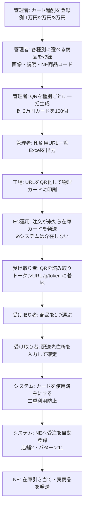
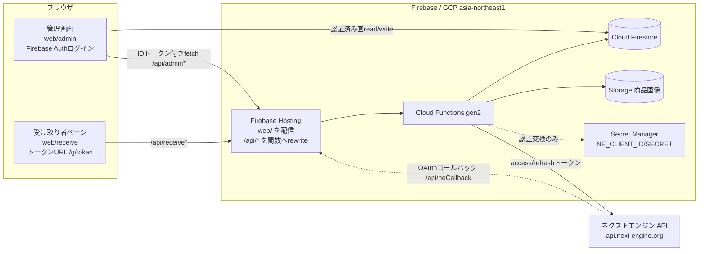
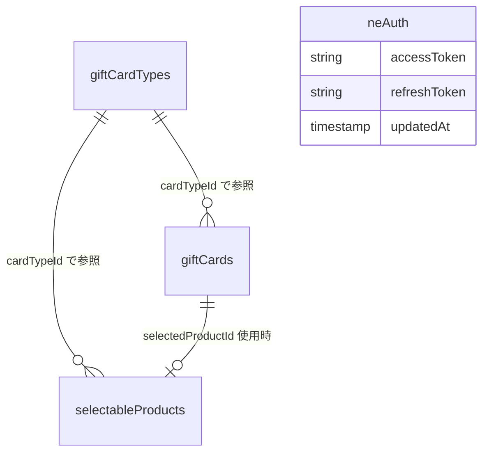
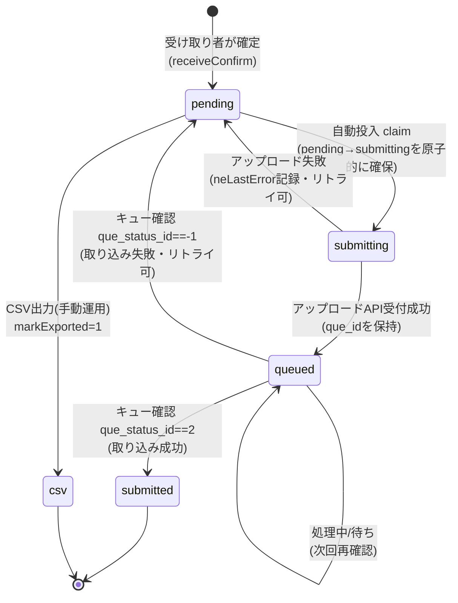
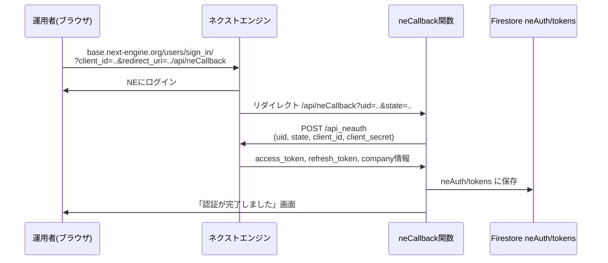
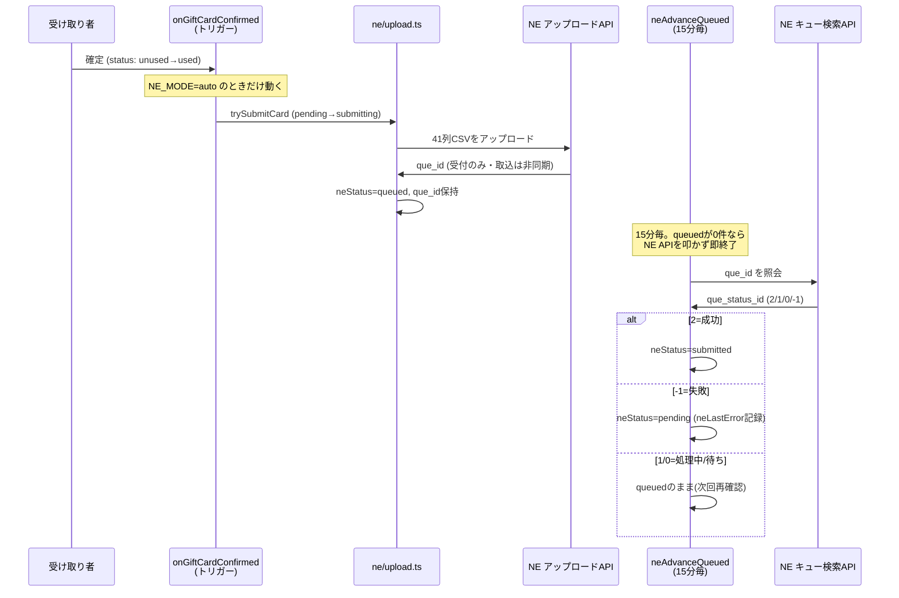

# gift-system 詳細仕様書（引き継ぎ完全版）

> **このドキュメントの目的**
> gift-system を**初めて見る第三者**が、前提知識ゼロの状態から仕様を完全に把握し、保守・改修・運用を引き継げるようにするための仕様書です。
> 「何が実装されているか」だけでなく **「なぜそうなっているか（設計判断の理由）」** を各所に明記しています。理由が分からないと、後任者が良かれと思って壊すためです。
>
> **正本の優先順位**：迷ったら **実装コードが正**です。本書は 2026-07-13 時点の実装（リポジトリ `webka-system/gift-system`）を読んで書き起こしています。`docs/design.md`（当初設計）と `docs/progress.md`（開発ワークログ）も併読してください。設計と実装が食い違う場合、実装を信じてください。
>
> **最終更新**：2026-07-13

---

## 目次

1. [システム概要](#1-システム概要)
2. [アーキテクチャ](#2-アーキテクチャ)
3. [データモデル（Firestore）](#3-データモデルfirestore)
4. [各機能の仕様](#4-各機能の仕様)
5. [ネクストエンジン（NE）連携](#5-ネクストエンジンne連携)
6. [環境・設定](#6-環境設定)
7. [デプロイ手順と運用上の注意](#7-デプロイ手順と運用上の注意)
8. [過去に起きた問題と解決](#8-過去に起きた問題と解決)
9. [未実装・今後の課題](#9-未実装今後の課題)
10. [用語集](#10-用語集)

---

## 1. システム概要

### 1.1 何をするシステムか

**物理ギフトカードに印刷した QR コードを起点とする、ソーシャルギフトの受け取り・商品選定システム**です。

購入者がギフトカード（価格帯ごとに選べる商品が決まっている）を購入すると、あらかじめ QR コードが印刷された物理カードが発送されます。カードを受け取った人（＝**受け取り者**）は、QR コードをスマホで読み取り、価格帯に応じた商品ラインナップから 1 つを選び、配送先住所を入力します。住所が確定した時点で、**ネクストエンジン（NE / EC の受注・在庫・出荷を一元管理する SaaS）**へ受注データが自動登録され、実際の商品が発送されます。

平たく言うと「**QR 付きギフトカード → 受け取り者が商品と送り先を選ぶ → NE に受注が立って発送される**」を実現する Web システムです。

### 1.2 業務フロー全体



**ポイント（なぜこの流れか）**：
QR コードを**受注と切り離して先に生成**しておく運用のため、「住所未確定のまま宙に浮く受注」が存在しません。物理カードの発送は通常の EC 受注そのもの（既存 EC 運用に任せる）で、システムは介在しません。NE へ流すのは受け取り者が住所を確定したときだけで、その時点で住所は必ず揃っています。この結果、モール API 連携・受注ポーリング・期限切れフォールバックといった複雑な要素がすべて不要になっています。

### 1.3 スコープ外（やらないこと）とその理由

| やらないこと | 理由 |
|---|---|
| **MakeShop / 楽天 / Amazon などモールの API とは連携しない**。受注取得のポーリングも不要 | 物理カードの発送は既存 EC 運用に任せる。システムが扱うのは「受け取り者が住所を確定した後の NE への受注登録」だけ。モール側の受注はシステムの関心事ではない |
| **QR カードと元の購入受注をシステム的に紐づけない** | 突合が必要なら管理画面の `memo` 欄に手入力で対応する。自動突合の仕組みはコスト過大で不要と判断 |
| **購入者（贈り主）の情報を持たない** | このシステムが知るのは「受け取り者」だけ。NE の受注者ブロックも発送先ブロックも受け取り者本人で埋める（[5.4](#54-neへ入れる固定値と項目マッピング)参照） |
| **メッセージカード作成・メッセージ選択機能は持たない** | これは URL 方式のソーシャルギフトで必要になる機能。本 QR 方式には含めない |
| **自前のメール送信（SendGrid 等）をしない** | 注文受付・発送通知メールは **NE のメール機能**に任せる。受け取り者への即時の安心感は「確定完了画面」で担保する（メール＝事後確認、画面＝即時の安心、と役割を分ける） |
| **URL 方式の「期限内に住所未確定なら購入者住所へ発送」フォールバックを持たない** | 物理カードは既に購入者住所へ届いており、宙に浮く受注が存在しないため不要 |

---

## 2. アーキテクチャ

### 2.1 技術スタック

| 領域 | 採用技術 | 補足 |
|---|---|---|
| クラウド基盤 | GCP / Firebase | プロジェクト `gift-system-f33b5` |
| データベース | Cloud Firestore | ロケーション **asia-northeast1（東京・変更不可）**。本番モード（テストモードではない） |
| ホスティング | Firebase Hosting | 管理画面・受け取り者画面の配信。`public` ディレクトリは `web/` |
| 画像保存 | Firebase Storage | 商品画像（`products/**`） |
| サーバー処理 | Cloud Functions（第2世代 / gen2） | TypeScript / Node.js 22 / `firebase-functions/v2` |
| 認証 | Firebase Authentication | **管理画面のみ**（メール/パスワード）。受け取り者側は認証なし（トークンURL） |
| 課金プラン | **Blaze**（従量課金） | Cloud Functions からの外部通信（NE API 呼び出し）に必須 |
| ソース管理 | GitHub | `webka-system/gift-system` |
| 秘匿値管理 | Secret Manager | NE の `client_id` / `client_secret` |

**なぜ Firestore/Functions か**：シールデザインシステム（社内の別プロダクト `label-system`）と同一構成に揃え、運用ノウハウを共有するため。フロントのビルド構成も label-system に準拠。

### 2.2 全体構成図



**重要な設計**：管理画面は Firestore を**直接** read/write することがあります（種別・商品・カード一覧の取得、memo 保存など）。ただし**認証済みユーザーに限る**（Firestore ルールで担保）。一方、受け取り者は **Firestore を一切触れません**。トークン照合・確定・使用済み化はすべて Cloud Functions（Admin SDK）経由で行います（理由は [2.5](#25-認証認可の設計) 参照）。

### 2.3 全関数の一覧と役割

Cloud Functions のエントリポイントは `functions/src/index.ts` です。全関数をここから re-export しています。

#### HTTP 関数（`onRequest`）

Firebase Hosting の `rewrites`（`firebase.json`）で `/api/<関数名>` から呼び出されます。

| 関数名 | メソッド/パス | 役割 | 認証 |
|---|---|---|---|
| `adminGenerateGiftCards` | POST `/api/adminGenerateGiftCards` | QR カードを種別指定で一括生成（1〜1000枚）。トークンをサーバ生成、`batchId`/`generatedAt` を記録 | requireAuth |
| `receiveGetCard` | GET `/api/receiveGetCard?token=` | トークンでカードを引き、状態（unused/used/expired）＋商品ラインナップを返す | トークン照合 |
| `receiveConfirm` | POST `/api/receiveConfirm` | 商品選択＋住所を受け、**トランザクションで確定・使用済み化**。`neStatus:pending` を記録 | トークン照合 |
| `adminExportNeCsv` | GET `/api/adminExportNeCsv[?markExported=1]` | 未投入受注を **NE 取込用 41列 Shift-JIS CSV** で出力。`markExported=1` で `neStatus:csv` に更新 | requireAuth |
| `adminRetryNeSubmissions` | POST `/api/adminRetryNeSubmissions[?cardId=&limit=]` | NE への手動投入＋queued の結果確認。`cardId=` で1件だけ／`limit=` で件数制限 | requireAuth |
| `neCallback` | GET `/api/neCallback` | **NE OAuth コールバック（本番）**。uid+state を受け /api_neauth でトークン交換して Firestore 保存 | NE リダイレクト（Secret 注入あり） |
| `neCallbackTest` | GET `/api/neCallbackTest` | NE OAuth コールバック（テスト用）。現状は受領確認のみのスタブ | 同上 |
| `adminExportUrlXlsx` | GET `/api/adminExportUrlXlsx` | 印刷工場入稿用の**受け取り者URL一覧 Excel(xlsx)** を出力。種別/未印刷/ロット/生成日範囲で絞り込み | requireAuth |
| `adminUpdateGiftCard` | POST `/api/adminUpdateGiftCard` | 使用済みカードの受注内容（商品・住所・メール・配達希望）を管理者が上書き編集 | requireAuth |
| `adminResetGiftCard` | POST `/api/adminResetGiftCard` | 使用済み→未使用へ戻す（やり直し）。戻す直前の内容を履歴に保存 | requireAuth |
| `adminSetCardExpiry` | POST `/api/adminSetCardExpiry` | 個別カードの有効期限日数を上書き（延長/短縮/解除）。期限切れカードの救済に使う | requireAuth |

#### Firestore トリガー（`onDocumentWritten`）

| 関数名 | 監視対象 | 役割 |
|---|---|---|
| `onGiftCardConfirmed` | `giftCards/{cardId}` の書き込み | カードが **unused → used に遷移した瞬間だけ**反応し、NE へ自動投入（アップロード=queued化）を試みる。`NE_MODE=auto` のときのみ動作 |

#### スケジューラ関数（`onSchedule` / Cloud Scheduler）

| 関数名 | 実行間隔 | 役割 |
|---|---|---|
| `neAdvanceQueued` | **15分毎** | `queued` 状態のカードの `que_id` を NE のキュー検索APIで照会し、`submitted`（成功）/`pending`（失敗）に確定する。`NE_MODE=auto` のときのみ動作。**queued が1件も無ければ NE API を叩かない**（[5.6](#56-自動投入の全体フロー)参照） |

### 2.4 フロントエンド構成

```
web/
├── admin/              管理画面（要ログイン）
│   ├── index.html
│   ├── js/
│   │   ├── admin.js        画面制御の本体（一覧・詳細・編集・NE手動投入 等）
│   │   ├── db.js           Firestore 直アクセス（種別・商品・カード取得、memo保存）
│   │   ├── cards-filter.js QR一覧のクライアント側フィルタ（純粋関数・単体テスト対象）
│   │   └── status.js       neStatus → バッジ表示の変換（純粋関数）
│   └── css/admin.css
├── receive/            受け取り者ページ（ログイン不要）
│   ├── index.html
│   ├── js/receive.js       トークン照合〜商品選択〜住所入力〜確定
│   └── css/receive.css
└── shared/             ★shared/*.js の配信用コピー（git管理下・下記参照）
    ├── constants.js
    ├── expiry.js
    └── delivery.js
```

**`shared/` の共有モジュール（最重要の仕組み）**：
`shared/constants.js` などは、**フロント（ブラウザ）とバックエンド（Functions）の両方が参照する単一情報源（SSOT）**です。

- **Functions 側**：`functions/tsconfig.json` の `include` に `../shared/*.js` を含め、TypeScript がコンパイル時に取り込む（`functions/src/config/constants.ts` などが re-export）。
- **ブラウザ側**：ブラウザは `../shared` にアクセスできない（Hosting は `web/` しか配信しない）ため、`shared/*.js` を **`web/shared/` にコピー**して配信する。このコピーは `scripts/sync-shared.js` が行う（`shared/` 配下の全 `.js` を自動コピー）。
- **`web/shared/` は git 管理下に置いている**（`.gitignore` で除外していない）。理由は [8.6](#86-shared資産の配信漏れで受け取り者ページが落ちた事故) の障害対策。**`shared/*.js` を変更したら `node scripts/sync-shared.js` を実行して `web/shared/` を再生成し commit すること。**

**共有される定数（`shared/constants.js`）**：`COLLECTIONS`（コレクション名）/ `CARD_STATUS` / `NE_STATUS` / `NE_MODE` / `TOKEN`（トークン仕様）/ `QR_GENERATION` / `REGION` / `URL_EXPORT` / `NE_FIXED`（NE固定値）/ `EXPIRY_CONTACT` / `PRODUCT` / `PREFECTURES`（47都道府県）/ `DELIVERY`（配達希望の範囲・時間帯）。

### 2.5 認証・認可の設計

このシステムは **「Cloud Run の入口は public、認証はアプリ層で担保」** というハイブリッド構成です。

```mermaid
flowchart TD
    subgraph 管理画面
      A1[Firebase Authでログイン] --> A2[IDトークンをAuthorizationヘッダに付与]
      A2 --> A3[/api/admin* を呼ぶ]
      A3 --> A4[requireAuth がIDトークン検証<br/>失敗は401]
    end
    subgraph 受け取り者
      B1[トークンURL /g/token で着地] --> B2[/api/receive* を token付きで呼ぶ]
      B2 --> B3[サーバがトークン照合<br/>推測不可能なランダム値が唯一の鍵]
    end
    subgraph CloudRun入口
      C[invoker=public<br/>allUsers呼び出し可]
    end
    A3 --> C
    B2 --> C
```

**なぜ Cloud Run を public にしてアプリ層で認証するのか**：

1. Firebase Hosting の `/api` rewrite から関数を叩くには、Cloud Run の入口（invoker IAM）が `allUsers`（public）である必要がある。
2. 会社の**組織ポリシー**（`maru-sin.co.jp`）が `allUsers` 公開を制限しているため、`firebase deploy` からの invoker 自動設定が失敗する。そこで **Cloud Run コンソールで手動 public 設定**する運用（[7.3](#73-新規http関数を追加したときのcloud-run手動public設定)参照）。
3. Cloud Run の入口が public でも、**セキュリティはアプリ層で担保**：
   - **管理 API**：`requireAuth`（`functions/src/http/guard.ts`）が Firebase Auth の ID トークンを検証。未認証/不正トークンは 401。「ログイン済み＝管理者」とみなす簡易モデル（一般公開のサインアップは無く、アカウントは管理者がコンソール等で発行）。
   - **受け取り者**：推測不可能なランダムトークン（`TOKEN.BYTES=24` バイトの base64url）が唯一のアクセス制御。トークンを知らなければカードにアクセスできない。

**Firestore セキュリティルール（`firestore.rules`）**：
- **既定は全拒否**（catch-all deny）。
- `giftCardTypes` / `selectableProducts` / `giftCards` は **ログイン済み（＝管理者）のみ read/write**。
- 受け取り者向けの口は**開けない**。受け取り者の操作はすべて Functions（Admin SDK はルールをバイパスする）経由。これにより**トークン列挙・二重利用・直接改ざんを防ぐ**。
- `neAuth`（NE トークン保管）はルールに書かない＝全拒否。Functions からのみアクセス可能。

> **将来の拡張ポイント**：現在は「ログイン済み＝管理者」。`admins` コレクション照合による operator ロールを導入するなら、`guard.ts` の `requireAuth` と `firestore.rules` の `isSignedIn()` を差し替える（コメントに明記済み）。

---

## 3. データモデル（Firestore）

Firestore のコレクションは 4 つです。中心は「価格帯（親）とその中の選択肢（子）」の入れ子構造。型定義の正本は `functions/src/models/index.ts`。



### 3.1 giftCardTypes（ギフトカード種別 / 親）

価格帯ごとに 1 レコード。

| フィールド | 型 | 必須 | 意味 |
|---|---|---|---|
| （ドキュメントID） | string | — | 種別ID |
| `name` | string | ✓ | 表示名（例「3万円ギフトカード」） |
| `price` | number | ✓ | 価格帯（例 30000） |
| `cardProductCode` | string | ✓ | ギフトカード側の管理商品コード |
| `expiryDays` | number | 任意 | 有効期限の日数（デフォルト）。生成日 `generatedAt` からこの日数で期限切れ。**未設定/0以下は無期限** |
| `createdAt` | Timestamp | ✓ | 作成日時 |
| `active` | boolean | ✓ | 有効/無効 |

### 3.2 selectableProducts（選定可能商品 / 子）

各カード種別にぶら下がる、受け取り者が選べる商品。

| フィールド | 型 | 必須 | 意味 |
|---|---|---|---|
| （ドキュメントID） | string | — | 商品ID |
| `cardTypeId` | string | ✓ | 所属する種別ID。**同じ商品が複数の価格帯にまたがることはない**ため、種別への単純な参照でよい（多対多は不要） |
| `name` | string | ✓ | 商品名 |
| `description` | string | ✓ | 商品説明 |
| `imageUrl` | string | ✓ | メイン画像URL（Storage） |
| `additionalImages` | string[] | 任意 | 追加画像URL（最大 `PRODUCT.MAX_ADDITIONAL_IMAGES=4` 枚。メインと合わせて最大5枚）。**後方互換**：無い既存商品は `[]` 扱い |
| `setContents` | string | 任意 | セット内容（改行区切り＝1行1項目）。説明文とは独立。**後方互換**：無ければ `""` |
| `neProductCode` | string | ✓ | 選定されたとき NE へ流す実商品コード |
| `active` | boolean | ✓ | 有効/無効。無効商品は受け取り者に出さない |

### 3.3 giftCards（発行済みQRカード）

先に一括生成しておくカード。生成時点では「まだ誰のものでもない空のカード」。受け取り者が使用して初めて受注として立ち上がる。

**生成時に書かれるフィールド**：

| フィールド | 型 | 意味 |
|---|---|---|
| （ドキュメントID） | string | カードID |
| `token` | string | 推測不可能なユニークトークン（URL用）。base64url・24バイト由来 |
| `cardTypeId` | string | どの価格帯のカードか |
| `status` | `"unused"` \| `"used"` | 未使用／使用済 |
| `memo` | string | 管理者の自由記入欄（受注番号など突合用） |
| `createdAt` | Timestamp | 生成日時 |
| `printed` | boolean | 印刷用出力済みか（未印刷抽出用）。生成時 `false` |
| `printedAt` | Timestamp? | 印刷用出力した日時 |
| `generatedAt` | Timestamp? | 生成日時（ロット管理・有効期限の起点）。**既存カードには無い場合あり＝後方互換で無期限扱い** |
| `batchId` | string? | 生成バッチID（同一の一括生成をまとめる識別子。ロット絞り込み用） |
| `expiryDaysOverride` | number? | 有効期限日数の個別上書き（種別デフォルトより優先。管理者が延長/短縮） |

**使用（受け取り者の確定）時に書かれるフィールド**：

| フィールド | 型 | 意味 |
|---|---|---|
| `selectedProductId` | string? | 受け取り者が選んだ商品 |
| `shippingAddress` | object? | 配送先住所（下記） |
| `recipientEmail` | string? | 受け取り者のメール（NE の受注メールアドレス＝通知宛先） |
| `deliveryDate` | string? | 配達希望日（"YYYY-MM-DD"・任意）。確定日+14日〜+2か月の範囲 |
| `deliveryTime` | string? | 配達希望時間帯（任意。`DELIVERY.TIME_SLOTS` のいずれか） |
| `usedAt` | Timestamp? | 使用（確定）日時 |
| `neStatus` | string? | NE投入状態（[3.5](#35-nestatus-の状態遷移最重要)参照） |
| `neQueId` | string? | アップロードAPIの `que_id`（queued 時に保持。取込結果確認に使う） |
| `neQueuedAt` | Timestamp? | queued 化した日時 |
| `neSubmittedAt` | Timestamp? | 投入成功（submitted）日時 |
| `neLastError` | string? | 直近のNE投入失敗理由（運用調査用。顧客情報は含めない） |
| `neAttempts` | number? | NE投入の試行回数 |

**shippingAddress（配送先住所）**：

| フィールド | 型 | 必須 | 意味 |
|---|---|---|---|
| `name` | string | ✓ | 氏名 |
| `nameKana` | string | ✓ | 氏名カナ（全角カナ。NE の受注名カナに必要） |
| `postalCode` | string | ✓ | 郵便番号 |
| `prefecture` | string | ✓ | 都道府県 |
| `address` | string | ✓ | 市区町村・番地 |
| `building` | string? | 任意 | 建物名・部屋番号 |
| `phone` | string | ✓ | 電話番号 |

**やり直し（未使用へ戻す）時の履歴** `previousSubmissions[]`：やり直しのたびに、戻す直前の入力（`selectedProductId`/`shippingAddress`/`recipientEmail`/`deliveryDate`/`deliveryTime`/`usedAt`/`neStatus`）＋`resetAt`/`resetBy` を push。監査用に `lastEditedAt`/`lastEditedBy` も記録。

> **後方互換の鉄則**：新フィールド（`generatedAt`/`batchId`/`additionalImages`/`setContents` 等）は**すべて任意**にし、無い既存ドキュメントでも壊れないよう既定値（`[]`/`""`/「無期限」など）で扱う。**全体デフォルトを入れて既存カードを遡って無効化しない**（例：有効期限は種別に `expiryDays` を明示設定したものだけ有効。未設定は無期限）。これは「稼働中の本番データを破壊しない」ための最重要方針。

### 3.4 neAuth（NE 認証トークン保管）

`neAuth/tokens` の単一ドキュメント。NE の OAuth トークンを保持する。

| フィールド | 型 | 意味 |
|---|---|---|
| `accessToken` | string | NE アクセストークン（有効期限 24時間） |
| `refreshToken` | string | NE リフレッシュトークン（有効期限 72時間） |
| `updatedAt` | Timestamp | 最終更新日時 |

**なぜ .env でなく Firestore か**：NE は API 呼び出しのレスポンスで**新しいトークンを返し、古い値は無効になる**（[5.5](#55-トークンローテーションne連携の最重要のクセ)参照）。頻繁に書き換わるため .env（デプロイ時固定）ではなく Firestore に置く。`firestore.rules` は `neAuth` を書いていない＝クライアント全拒否。読み書きは Functions（Admin SDK）のみ。

### 3.5 neStatus の状態遷移（最重要）

`neStatus` は「NE へ投入したか」を表す。**特に `queued` が存在する理由**を理解しないと、NE 連携を壊します。



| 状態 | 意味 |
|---|---|
| `pending` | 未投入。自動トリガー・手動リトライ・CSV出力が拾う対象 |
| `submitting` | 自動投入の処理中（claim による二重投入防止の中間状態） |
| `queued` | **アップロードAPIに受付済み**（`que_id` 保持）。取り込みの成否が確定するまでの中間状態 |
| `submitted` | 投入済（キューが正常終了＝取り込み成功） |
| `csv` | CSV 出力済（手動/日次取込ルート） |
| `error` | 予約（当面は失敗時 `pending` に戻す運用のため使わない） |

**なぜ `queued` が必要か（設計判断の核心）**：
NE の受注伝票アップロードAPI（`/api_v1_receiveorder_base/upload`）は **完全な非同期キュー方式**です。アップロードのレスポンスは `que_id` を返すだけで、この時点では「キューに受付された」だけであり「実際に受注が登録された」わけではありません。もし受付＝成功として `submitted` にしてしまうと、キューでの取り込みが失敗（重複・不正データ等）していても「投入済み」と誤認し、**発送漏れ**が発生します。

そこで、アップロード受付は `queued`（+`que_id`保持）にとどめ、別途キュー検索API（`/api_v1_system_que/search`）で `que_status_id==2`（全処理成功）を確認して初めて `submitted` にします。失敗（`-1`）なら `pending` に戻してリトライ可能にします。**「失敗は pending に戻す＝発送漏れを絶対に見逃さない」**が一貫した設計思想です。

---

## 4. 各機能の仕様

### 4.1 管理画面（要ログイン / `web/admin`）

Firebase Auth（メール/パスワード）でログインしてから使う業務ツール。タブ構成。

#### カード種別管理
価格帯（種別）の登録・編集・有効/無効切り替え。有効期限日数（`expiryDays`）もここで設定。

#### 選定可能商品管理
各種別への商品登録・編集。**メイン画像＋追加画像（最大4枚）**のアップロード、**セット内容**（1行1項目）、商品説明、**NE用商品コード**。追加画像は既存URLを保持しつつ新規ファイルのみ Storage へアップロード。

#### QR コード一括生成（ロット管理）
種別を指定して 1〜`QR_GENERATION.MAX_PER_BATCH`(=1000) 枚を生成。実装は `adminGenerateGiftCards`。

- **トークンはサーバ側で生成**（推測不可能性の担保。`lib/token.ts` の `generateCardToken` が `TOKEN.BYTES=24` バイトの base64url を生成）。
- 各カードに **`generatedAt`（生成日時）と `batchId`（ロットID）** を記録。`batchId` はこの一括生成1回分を識別（ロット絞り込み・突合用）。
- Firestore の WriteBatch は1回500件までのため、500件ずつチャンク分割して書き込む。
- 生成時点は `status:unused` / `memo:""` / `printed:false` の空カード。

#### QR一覧管理（検索・絞り込み・ステータス色分け）
- 列順：生成日時（ロット）→ 状態 → 種別 → 受け取り者名 → 使用日時 → memo → 操作。
- **検索**：名前・カナ・メール・memo・トークンの部分一致（クライアント側フィルタ・リアルタイム）。実装は純粋モジュール `cards-filter.js`。
- **絞り込み**：種別・状態・NE投入状態・ロット（batchId）・生成日範囲・期限切れ/期限間近。
- **ステータス色分け**（`status.js`）：未使用（青）/使用済（灰）＋ NE投入状態バッジ（投入済/CSV出力済=緑、投入中/受付済(queued)=黄、**投入失敗=赤・太字・枠付きで最も目立たせる**＝発送漏れ防止、未投入=橙）。

#### 受注詳細ビュー（モーダル）
種別・状態・選択商品・配送先住所・連絡先/配達希望・確定日時・**NE投入状態**・受け取り者URL・memo編集・有効期限管理・管理者操作（編集/やり直し）・**ネクストエンジン投入**（[5.7](#57-管理画面からの手動投入)）を表示。

#### 受注内容の編集（`adminUpdateGiftCard`）
使用済みカードの受注内容（選択商品・氏名/カナ/郵便/都道府県/住所/建物/電話・メール・配達希望日/時間帯）を管理者が上書き。

- **バリデーションは受け取り者と共通**（`order-fields.ts`）。選択商品は同じ種別に限定。
- `neStatus`/`usedAt` は据え置き（NE は自動更新されない）。`lastEditedAt`/`lastEditedBy` を記録。
- **なぜ Functions 経由か**：受け取り者と同一の検証をサーバで適用し、トランザクションで整合性を保つため。直 Firestore ではルールで複雑検証を書けず整合性リスクが高い。
- NE投入済み（submitted/csv/submitting/queued）なら「NE側は自動更新されないため手動修正を」の警告を出す（操作はブロックしない）。

#### 使用済み→未使用に戻す（やり直し・履歴保持 / `adminResetGiftCard`）
使用済みカードを未使用へ戻し、受け取り者が同じURLで再入力できるようにする。

- 戻す直前の入力を `previousSubmissions[]` に push して**履歴を保持**（`resetAt`/`resetBy` 付き）。
- カード本体は `status=unused` に戻し、`selectedProductId`/`shippingAddress`/`recipientEmail`/`deliveryDate`/`deliveryTime`/`usedAt`/`neStatus` 等をクリア。**トークンは不変**。
- NE投入済みなら警告（NE側は自動で戻らない）。

#### 有効期限の設定と延長（`adminSetCardExpiry`）
個別カードの `expiryDaysOverride` を設定（生成日起点で再計算）。**期限切れカードもここで延長すれば再び受け取り可能**。空欄保存で上書き解除（種別デフォルト/無期限に戻る）。

#### 印刷用URL一覧Excel出力（`adminExportUrlXlsx`）
印刷工場の入稿方式に合わせ、受け取り者URL（`origin + /g/<token>`）を1行ずつ並べた Excel を出力。

- 既定は A=URL / B=token / C=種別名（`URL_EXPORT` 定数で URL のみ・ヘッダ有無を切替可）。
- 対象選択：種別 / 未印刷のみ / ロット（batchId）/ 生成日範囲。
- **なぜ Excel（PDF面付けではない）か**：印刷は「工場がURL一覧ExcelからQR化・印刷」する方式に確定したため。当初実装したPDF面付けはURL一覧Excelに差し替え済み。

#### NE用CSV出力（`adminExportNeCsv`）
未投入受注を **41列 Shift-JIS CSV** で出力（手動/日次取込用）。`?markExported=1` で出力分を `neStatus:csv` に更新（二重取込防止）。詳細は [5.4](#54-neへ入れる固定値と項目マッピング)。

#### NE手動投入・結果確認
カード詳細の「ネクストエンジン投入」から、失敗カードの手動再投入・queued の結果確認ができる（[5.7](#57-管理画面からの手動投入)）。

### 4.2 受け取り者ページ（ログイン不要 / `web/receive`）

QR で着地する受け取り者向け画面。スマホ最優先。実装は `receive.js`。

**フロー**：トークンURL `/g/<token>` で着地 → `receiveGetCard` で状態と商品ラインナップ取得 → 商品を1つ選択（詳細モーダル：画像ギャラリー・セット内容・説明）→ 配送先住所入力 → 確定（`receiveConfirm`）→ 完了画面。

**住所入力フォーム**：氏名・氏名カナ（全角カナ必須）・郵便番号・都道府県・住所・建物・電話・メール・配達希望日/時間帯（任意）。

- **郵便番号→住所自動補完**：zipcloud API（`https://zipcloud.ibsnet.co.jp/api/search`）をクライアントから直 fetch（CORS 許可済み＝プロキシ/Functions 不要）。7桁そろったら都道府県プルダウンと住所欄を補助的に補完（補完後も手修正可）。
- **都道府県はプルダウン**（`PREFECTURES` 47件。zipcloud の `address1` と厳密一致）。
- **配達希望日の範囲制限**：確定日+14日〜+2か月（`DELIVERY.MIN_DAYS=14`/`MAX_MONTHS=2`）。選択の瞬間にクライアント側で範囲検証し、範囲外はその場でエラー＋確定無効化（[8.5](#85-ios-safari-が-inputtypedate-の-minmax-を無視する) 参照）。サーバ（`order-fields.ts`）でも JST 基準で必ず検証。

**状態別の表示**：
- `unused`（期限内）：通常の商品選択フロー。
- `used`：「使用済み」表示（二重利用防止。商品情報は返さない）。
- `expired`：期限切れ専用画面＋問い合わせ先（`EXPIRY_CONTACT`）。
- 無効トークン（404）：エラー表示。

**メール通知方針**：確定時に自前メールは送らない。NE 側の受付/発送メールに任せる。即時の安心感は完了画面（「ご注文を受け付けました。確認メールは追ってお送りします」）で担保。

### 4.3 二重確定防止の仕組み（重要）

受け取り者が同じカードを2回確定する、または同時アクセスで二重に注文が立つのを防ぐ核心。

**実装**（`receiveConfirm` / `receive.ts`）：Firestore の**トランザクション内**で、
1. トークンでカードを引く（無ければ 404）。
2. **「この瞬間に `status` が `unused` であること」を検証**（`used` なら 409 `already_used`）。
3. 有効期限切れでないか（トランザクション内で種別を読み判定。期限切れは 410 `expired`）。
4. 選択商品が実在し・同じ種別・有効か（不正なら 400 `invalid_product`）。
5. すべて通れば `status=used` に更新＋確定内容を記録＋`neStatus=pending`。

トランザクションなので、2つのリクエストが同時に来ても片方だけが成功し、もう片方は「既に used」で弾かれます。**クライアント側の判定に依存せず、サーバのトランザクションが最終防衛線**である点が重要。

### 4.4 有効期限の仕様

生成日（`generatedAt`）を起点に、種別デフォルト（`expiryDays`）＋個別上書き（`expiryDaysOverride`）で判定。純粋ロジックは `shared/expiry.js`（受け取り者・管理画面・サーバで共有）。

- **優先順位**：個別上書き `expiryDaysOverride` ＞ 種別デフォルト `expiryDays`。
- **期限切れは受け取り不可**：`receiveGetCard` は `status:"expired"` を返し、`receiveConfirm` はトランザクション内で 410 で弾く（クライアント判定に頼らない）。
- **管理者が延長可能**：`adminSetCardExpiry` で `expiryDaysOverride` を設定すれば期限切れカードも復活。
- **未設定は無期限**：`generatedAt` が無い、または `expiryDays`/`expiryDaysOverride` が未設定/0以下のカードは**無期限**（期限切れにしない）。
- **なぜ未設定＝無期限か（超重要）**：全体デフォルトを入れると、既存の稼働中カードが遡って無効化される破壊的変化になる。明示的に種別へ `expiryDays` を設定したものだけ期限が有効になる安全設計。

---

## 5. ネクストエンジン（NE）連携

**このシステムで最も複雑かつ壊れやすい部分**。NE の作法（非同期キュー・トークンローテーション）を理解せずに触ると連携が止まります。

### 5.1 投入先：なぜ店舗2・パターン11か

gift-system 由来（カタログギフト）の受注を、NE 上では **「店舗2（2:九州お取り寄せ本舗(makeshop)）」の受注**として登録します。

- **なぜ店舗2か**：会社の**月次集計が店舗単位**で行われるため、カタログギフト商品は店舗2として集計する必要がある（業務要件）。
- **どうやって店舗を指定するか（重要な仕様）**：NE では「どの店舗の受注か」は **CSVの列では指定しません**。受注伝票アップロードAPI に渡す **`receive_order_upload_pattern_id`（受注一括登録パターンID）**で決まります。パターンが店舗に紐づいているためです。

**3つの紛らわしい番号（混同するとエラー）**：

| 番号 | 名前 | 値 | 用途 |
|---|---|---|---|
| (a) `receive_order_shop_id` | 店舗コード | **2** | 店舗そのものの番号。パターンID特定時の照合キー。アップロードには直接使わない |
| (b) `receive_order_upload_pattern_id` | 受注一括登録パターンID | **11** | **アップロードAPIに渡すのはこれ**。(a)とは別番号 |
| (c) フォーマットパターンID | CSVフォーマット | **90**（汎用標準） | パターン11が使うCSV形式。(b)とは別物 |

**なぜパターン11か（経緯）**：
店舗2には元々パターン4（名前「九州お取り寄せ本舗(makeshop)(ネクストエンジンカート)」/ フォーマットID **100035**）がありましたが、これは makeshop の**実受注取込用**のカート形式で、gift-system の汎用マッピングと噛み合いませんでした。そこで **gift-system 専用に、フォーマット90（汎用標準）の新パターン11**（名前「九州お取り寄せ本舗(makeshop扱い ギフトカード)」）を新規作成し、これを使うことにしました。汎用90なので gift-system の 41列CSV マッピングと整合します。

> **★実接続前提**：パターン11は NE 管理画面で**有効化**しておく必要がある（無効/存在しないIDでアップロードすると「存在しない受注一括登録パターン」エラーで弾かれる）。`ne/upload-pattern.ts` の `resolveUploadPatternId` は info API を叩いて店舗2の gift 用パターン（名前に「ギフトカード」を含む有効パターン）を動的に特定するヘルパも用意しているが、実運用では `NE_UPLOAD_PATTERN_ID=11` を直接設定する。

### 5.2 使用する NE API エンドポイント

すべて `https://api.next-engine.org` 配下、POST（`application/x-www-form-urlencoded`）。

| エンドポイント | 用途 | 主なパラメータ |
|---|---|---|
| `/api_neauth` | 認証交換（初回トークン取得） | `uid`, `state`, `client_id`, `client_secret` |
| `/api_v1_receiveorder_base/upload` | 受注伝票アップロード（投入本体） | `access_token`, `refresh_token`, `receive_order_upload_pattern_id`(=11), `data_type_1`("csv"), `data_1`(CSV本体), `wait_flag` |
| `/api_v1_system_que/search` | アップロードキュー検索（取込結果確認） | `access_token`, `refresh_token`, `fields`, `que_id-eq`(絞込) |
| `/api_v1_receiveorder_uploadpattern/info` | パターン情報取得（パターンID動的特定） | `fields` |

### 5.3 認証（OAuth）フロー



- **開始URL**：`https://base.next-engine.org/users/sign_in/?client_id=<CLIENT_ID>&redirect_uri=<本番のneCallback URL>`。`client_secret` は不要。`redirect_uri` はホストが登録済みと一致している必要がある。`state` は数分で失効（切れたら開始URLからやり直し）。
- **トークン交換**：`neCallback`（本番のみ実装。`neCallbackTest` は受領確認スタブ）が `uid`+`state`+`client_id`+`client_secret` を `/api_neauth` に POST し、`access_token`/`refresh_token` を得て `neAuth/tokens` に保存。
- **client_id/secret が必要なのはこの交換だけ**。通常の v1 API（アップロード/キュー検索）は `access_token`+`refresh_token` のみで動く。だから client_id/secret は Secret Manager から **`neCallback` にのみ注入**し、投入経路には注入しない（露出面を最小化）。

### 5.4 NEへ入れる固定値と項目マッピング

**固定値**（`shared/constants.js` の `NE_FIXED`）：

| 項目 | 値 | 理由 |
|---|---|---|
| 支払方法 | 「ポイント全額払い」 | 購入時に支払い済みのギフト。NEは発送のみ担当 |
| 発送方法 | 「宅急便」 | 仮置き。NEが受け付ける正確な表記は要確認 |
| 商品価格 | 0円 | 支払い済みギフト |
| 受注数量 | 1 | 1カード=1商品 |
| 店舗伝票番号 | `token` | gift-system のトークンを流用（一意・他受注と衝突しない） |
| 受注者ブロック＝発送先ブロック | 受け取り者本人 | **購入者情報を持たないため**、両ブロックを受け取り者情報で埋める |

**CSVフォーマット（汎用41列・Shift-JIS必須）**：`ne/csv.ts` の `NE_CSV_COLUMNS` が正本。**ヘッダー名を一字一句合わせる必要がある**（全角「１」「２」「（%）」も正確に。1つでも違うと「受注住所１が存在しません」等でNEが弾く）。列と、gift-system のどのデータから入れるか：

| # | 列名 | 入れる値（マッピング元） |
|---|---|---|
| 1 | 店舗伝票番号 | `token` |
| 2 | 受注日 | `usedAt` を JST `yyyy/MM/dd HH:mm:ss` |
| 3 | 受注郵便番号 | `postalCode`（数字のみ） |
| 4 | 受注住所１ | `prefecture + address`（**必須・空にしない**） |
| 5 | 受注住所２ | `building` |
| 6 | 受注名 | `name` |
| 7 | 受注名カナ | `nameKana` |
| 8 | 受注電話番号 | `phone`（数字のみ） |
| 9 | 受注メールアドレス | `recipientEmail` |
| 10 | 発送郵便番号 | `postalCode`（受注者と同じ） |
| 11 | 発送先住所１ | `prefecture + address` |
| 12 | 発送先住所２ | `building` |
| 13 | 発送先名 | `name` |
| 14 | 発送先カナ | `nameKana` |
| 15 | 発送電話番号 | `phone` |
| 16 | 支払方法 | 「ポイント全額払い」 |
| 17 | 発送方法 | 「宅急便」 |
| 18-24 | 商品計/税金/発送料/手数料/ポイント/その他費用/合計金額 | すべて `0` |
| 25 | ギフトフラグ | `0` |
| 26 | 時間帯指定 | `時間帯指定[<変換後>]`（未指定は空。変換は下記） |
| 27 | 日付指定 | `deliveryDate` を `yyyy/MM/dd`（未指定は空） |
| 28 | 作業者欄 | 空 |
| 29 | 備考 | `memo` |
| 30 | 商品名 | 選択商品の `name` |
| 31 | 商品コード | 選択商品の `neProductCode` |
| 32 | 商品価格 | `0` |
| 33 | 受注数量 | `1` |
| 34-41 | 商品オプション/出荷済フラグ/顧客区分/顧客コード/消費税率（%）/のし/ラッピング/メッセージ | すべて空 |

**住所の分け方（注意）**：gift-system は住所を1フィールド（`address`）で持つため、住所１＝`都道府県+address`、住所２＝`building` と分ける。住所１を空にすると NE がエラーにするため必ず都道府県+住所を入れる。

**時間帯の変換**（`ne/order.ts` の `NE_DELIVERY_TIME_MAP`）：`午前中→午前中` / `14:00-16:00→14時-16時` / `16:00-18:00→16時-18時` / `18:00-20:00→18時-20時` / `19:00-21:00→19時-21時`。CSV側で `時間帯指定[○○]` に整形。

> **CSVマッピングの共通化**：`ne/rows.ts` の `giftCardToNeCsvRow()` が「カード→CSV1行」の変換を担い、**管理画面のCSV出力（`adminExportNeCsv`）とAPI自動投入（`ne/upload.ts`）の両方が同じ行データを生成**する。手動CSV取込で成功実証済みの形式をAPI投入でもそのまま使うため（フォーマット起因のトラブルを避ける）。

### 5.5 トークンローテーション（NE連携の最重要のクセ）

**これを怠ると連携が止まります。** NE のアクセストークンは**24時間**、リフレッシュトークンは**72時間**で有効。API 呼び出しのレスポンスで**新しいトークンが返ってくることがあり、返ってきたら必ず保存して次回に使う必要がある**（トークンが更新されると古い値は無効になる）。

**実装**（`ne/client.ts`）：すべての NE API 呼び出し（認証交換・アップロード・キュー検索）で、レスポンスに `access_token`/`refresh_token` が含まれていれば `neAuth/tokens` に保存する（`persistRotatedTokens`）。エラーレスポンスでもトークンが返れば保存する。この「返ってきた新トークンを保存し続ける」処理を全経路で通すことが連携継続の生命線。

> 72時間以上 API を叩かないとリフレッシュトークンが失効し、[5.3](#53-認証oauthフロー) の OAuth からやり直しになる。自動投入トリガー＋15分毎スケジューラが定期的に動くため、通常は失効しないが、`NE_MODE=csv` に長期間していると失効しうる点に注意。

### 5.6 自動投入の全体フロー



1. **確定 → 即アップロード**：受け取り者が確定すると `onGiftCardConfirmed` トリガーが `unused→used` の瞬間だけ反応し、`trySubmitCard` が CSV をアップロード（`pending→submitting→queued`）。即投入なので発送準備が早く始められる。
2. **キュー結果を自動確定**：`neAdvanceQueued`（15分毎の Cloud Scheduler）が `queued` カードの `que_id` を照会し、成功→`submitted` / 失敗→`pending` に確定。
3. **API回数の節約設計**：`neAdvanceQueued` は**まず Firestore を見て `queued` が1件も無ければ NE API を一切叩かず即終了**する。これにより NE API 呼び出しは受注数（queued 発生数）に比例したままになり、15分毎に動いても無駄打ちが発生しない。
   - **なぜ節約が重要か**：NE API は**月1000回 or 3GB から課金**。想定受注は月1000件規模に届かないため、受注1件あたり約2回（アップロード1＋キュー確認1）で十分余裕。バッチ化は不要と判断。

**`que_status_id` の意味**：`2`=全処理成功 / `1`=処理中 / `0`=処理待ち / `-1`=処理失敗。

### 5.7 管理画面からの手動投入

カード詳細の「ネクストエンジン投入」セクション（実装 `web/admin/js/admin.js`）。既存の `adminRetryNeSubmissions?cardId=<id>` を叩く（**新規HTTP関数を増やさない**＝Cloud Run 手動public設定を不要にするため）。

- 状態に応じてボタンが変わる：`pending`→「NEへ手動投入」（確認ダイアログ→queued）、`queued`→「取り込み結果を確認」（→submitted/pending）、`submitted/csv`→再投入不可（二重投入防止・やり直しを案内）。
- 失敗時は `neLastError` を詳細ビューで確認できる。
- 用途：自動投入が失敗して `pending` に残ったカードの手動リカバリ、段階テスト時の1件投入。

### 5.8 NE_MODE（投入モード）

`NE_MODE` 環境変数で投入の挙動を切り替える。

| モード | 自動トリガー | 手動投入(adminRetry) | 用途 |
|---|---|---|---|
| `auto` | 動く（確定時に即投入） | 動く | 本番運用 |
| `manual` | **動かない** | 動く | 段階テスト・慎重運用（自動投入を止めて1件だけ隔離して投入したいとき） |
| `csv` | 動かない | 動かない | 自動投入なし。CSV手動取込運用（最も安全・既定） |

- 投入ゲートは2つに分離：`isNeAutoConfigured()`（トリガー用＝auto のみ）と `isNeSubmitEnabled()`（手動投入用＝auto または manual）。いずれも `NE_UPLOAD_PATTERN_ID`（=11）が設定されていることが条件。
- **推奨の切り替え順**：`csv` →（デプロイ・OAuth）→ `manual` で1件テスト → 問題なければ `auto`。

### 5.9 失敗時の挙動

- アップロード失敗・キュー失敗はいずれも `neStatus` を **`pending` に戻す**（`status` は `used` のまま＝確定トリガーは再発火しない）。
- `neLastError` に理由、`neAttempts` に試行回数を記録。
- `pending` に戻ったカードは、次回の自動リトライ（トリガーは再発火しないが）・管理画面の手動投入・CSV出力のいずれでも拾える。**失敗を握りつぶさず必ずリトライ可能な状態に残す**のが設計思想。

### 5.10 CSV手動取込ルート（バックアップ）

自動投入とは別に、`adminExportNeCsv` で 41列 Shift-JIS CSV をダウンロードし、NE の受注一括登録画面で**店舗2・パターン11を指定して**手動取込することもできる。`?markExported=1` で出力分を `neStatus:csv` に更新（二重取込防止）。自動投入が使えない状況のフォールバック。

---

## 6. 環境・設定

### 6.1 環境変数・Secret

秘匿値と非秘匿値で管理場所を分ける。**秘匿値は絶対にコミットしない**（`.gitignore` 済み）。

| キー | 管理場所 | 値/例 | 説明 |
|---|---|---|---|
| `NE_CLIENT_ID` | **Secret Manager** | （NE発行） | NEアプリのクライアントID。認証交換専用 |
| `NE_CLIENT_SECRET` | **Secret Manager** | （NE発行） | NEアプリのクライアントシークレット。認証交換専用 |
| `NE_UPLOAD_PATTERN_ID` | `functions/.env` | `11` | 受注一括登録パターンID。**未設定だと投入無効**（安全側） |
| `NE_MODE` | `functions/.env` | `csv`/`manual`/`auto` | 投入モード |
| `PUBLIC_HOSTING_ORIGIN` | `functions/.env` | `https://gift-system-f33b5.web.app` | 受け取り者URL生成に使う公開ホスト |
| `NE_API_BASE` | `functions/.env`（任意） | `https://api.next-engine.org` | NE APIベースURL（既定あり） |
| `NE_AUTH_ENDPOINT` 等 | `functions/.env`（任意） | 既定あり | 各APIパス・`wait_flag`・`NE_STORE_CODE`。通常は未設定でよい |

**Secret Manager への登録**（デプロイ前に必須。未登録だと `neCallback` のデプロイが失敗する）：
```
firebase functions:secrets:set NE_CLIENT_ID
firebase functions:secrets:set NE_CLIENT_SECRET
```
`client_id/secret` は認証交換を行う `neCallback`/`neCallbackTest` にのみ注入される（`functions/src/config/secrets.ts` の `defineSecret`）。

**なぜ Secret Manager か**：`.env` はビルド成果物やログに残り得るのに対し、Secret Manager はデプロイ時に注入され値がコード/ログに出ない。Firebase 推奨方式。

### 6.2 本番環境の主要な識別子

| 項目 | 値 |
|---|---|
| Firebase プロジェクト | `gift-system-f33b5`（本番 hosting: `https://gift-system-f33b5.web.app`） |
| リージョン | `asia-northeast1`（東京・変更不可） |
| 関数サービスアカウント | `709387761372-compute@developer.gserviceaccount.com`（要 `roles/datastore.user`） |
| 組織 | `maru-sin.co.jp` / 組織ID `666430407577`（allUsers 公開を制限する組織ポリシーあり） |
| GitHub | `webka-system/gift-system` |
| NE Redirect URI（本番） | `https://gift-system-f33b5.web.app/api/neCallback` |
| NE Redirect URI（テスト） | `https://gift-system-f33b5.web.app/api/neCallbackTest` |

### 6.3 GitHub の認証（複数アカウント使い分け）

このマシンには別アカウント（`DELISHMALL`）の認証も存在するため、`gift-system` は `webka-system` アカウントで push する必要がある。**パス単位で資格情報を使い分ける**設定：

```
git config --global credential.useHttpPath true
```

これで `https://github.com/webka-system/...` と他リポジトリで別々の資格情報が使える（label-system と同じ方式）。通常は普通に `git push` でよい。push で 403 が出たら Windows「資格情報マネージャー」→「Windows 資格情報」の `git:https://github.com` を確認・差し替える。

---

## 7. デプロイ手順と運用上の注意

### 7.1 通常のデプロイコマンド

| 変更範囲 | コマンド |
|---|---|
| functions のみ | `firebase deploy --only functions` |
| hosting（web）のみ | `firebase deploy --only hosting` |
| 両方 | `firebase deploy --only functions,hosting` |

- `functions` の predeploy が lint / build を実行する。
- `hosting` の predeploy が `node scripts/sync-shared.js` を実行し `shared/*.js` を `web/shared/` にコピーする。

### 7.2 shared/*.js を変更したときの必須手順（事故多発ポイント）

**`shared/*.js`（`constants.js`/`expiry.js`/`delivery.js` 等）を追加・変更したら、必ず：**
```
node scripts/sync-shared.js
```
**を実行して `web/shared/` を再生成し、それも commit する。**

- **理由**：`web/shared/` は git 管理下に置いている（配信の安全網）。これを怠ると本番で `/shared/xxx.js` が古いまま or 404 になり、それを import している**受け取り者ページが白画面になる**（[8.6](#86-shared資産の配信漏れで受け取り者ページが落ちた事故) で実際に事故が起きた）。
- `scripts/sync-shared.js` は `shared/` 配下の全 `.js` を自動コピーするので、新ファイルを足してもコピー対象の列挙漏れは起きない。

### 7.3 新規HTTP関数を追加したときの Cloud Run 手動public設定

**これを知らないと必ずハマります。**

- 組織ポリシー（`maru-sin.co.jp`）が `allUsers` 公開を制限しているため、`firebase deploy` の invoker 自動設定は**必ず失敗する**（警告が出る）。
- **既存関数の更新なら実害なし**（既に public 設定済みのため。警告は無視してよい）。
- **新規 HTTP 関数を追加したときは、デプロイ後に Cloud Run コンソールで手動「パブリックアクセスを許可」設定が必要**。これをしないとその関数だけ 401 になる。
- `invoker:"public"` はコード（`functions/src/http/options.ts` の `HTTP_OPTIONS`）で宣言済みだが、組織ポリシーで反映されないため手動設定が要る。

**現在 public 設定が必要な HTTP 関数（11個）**：
```
adminGenerateGiftCards, receiveGetCard, receiveConfirm, adminExportNeCsv,
adminRetryNeSubmissions, neCallback, neCallbackTest, adminExportUrlXlsx,
adminUpdateGiftCard, adminResetGiftCard, adminSetCardExpiry
```

### 7.4 onSchedule 関数（neAdvanceQueued）は手動public設定「不要」

- `onSchedule`（Cloud Scheduler）は **Cloud Scheduler の専用サービスアカウントが OIDC トークンで呼ぶ**方式で、`allUsers` 公開では**ない**（HTTP関数の invoker=public とは別扱い）。
- 組織ポリシーの allUsers 制限にも抵触せず、**「パブリックアクセスを許可」の手動設定は不要**（むしろ公開してはいけない）。
- `firebase deploy` が Scheduler ジョブと invoker（Scheduler SA への `run.invoker`）を自動設定する。デプロイ後、Cloud Scheduler コンソールでジョブを「強制実行」→ `firebase functions:log --only neAdvanceQueued` で稼働確認するとよい。

### 7.5 関数サービスアカウントの権限

関数の SA `709387761372-compute@developer.gserviceaccount.com` に **`roles/datastore.user`（Cloud Datastore ユーザー）** が必要（Firestore アクセスのため）。これが無いと 500 エラーになる（[8.2](#82-firestoreアクセス権限不足による-500-エラー)）。

### 7.6 デプロイ後の動作確認の勘所

- 受け取り者ページ：`/shared/constants.js` と（もし使うなら）他の shared が 200 で配信されているか。実機（iPhone Safari）で `/g/<token>` を開き、商品選択→住所入力→確定まで通るか。
- 管理画面：Ctrl+Shift+R でハードリロード。
- NE：`neCallback` のログでトークン交換成功、`neAdvanceQueued` のログで稼働を確認。

---

## 8. 過去に起きた問題と解決（同じ轍を踏まないために）

### 8.1 組織ポリシーによる invoker 設定失敗
- **症状**：QR生成が 401。`firebase deploy` が「Failed to set the invoker」。
- **原因**：組織ポリシーが `allUsers` 公開を制限し、invoker 自動設定が通らない。
- **解決**：Cloud Run コンソールで手動「パブリックアクセスを許可」。→ [7.3](#73-新規http関数を追加したときのcloud-run手動public設定)。**新規HTTP関数を足すたびに再発する**ので必ず手動設定すること。

### 8.2 Firestoreアクセス権限不足による 500 エラー
- **症状**：401 解決後に 500。
- **原因**：関数の SA に Firestore 権限が無かった。
- **解決**：IAM で `roles/datastore.user` を付与。

### 8.3 CSS の [hidden] が display:flex/grid に負けてモーダル・フォームが消えない
- **症状**：モーダルを閉じられず暗転フリーズ、ログイン後もフォームが残る。
- **原因**：`.modal { display:flex }` 等のオーサーCSSが `hidden` 属性のUA既定（`display:none`）を上書きしていた。
- **解決**：`[hidden] { display:none !important; }` を追加（管理画面・受け取り者ページ両方で発生した）。**`hidden` 属性で表示制御する要素に `display` を当てるときはこのルールが要る**。

### 8.4 <td> に display:flex を掛けるとテーブルの罫線が崩れる
- **症状**：QR一覧の罫線が短く/ずれて描画される。
- **原因**：`border-collapse` のテーブルで `<td>` を直接 `display:flex` にすると table-cell ボックスでなくなり、行高さに追従せず罫線が崩れる。
- **解決**：flex は `<td>` 直ではなく**内側のラッパ**（`<span>`/`<div>`）に当てる。

### 8.5 iOS Safari が input[type=date] の min/max を無視する
- **症状**：iPhone で配達希望日が範囲制限（+14日〜+2か月）を超えて無限に選べる。
- **原因**：iOS Safari のネイティブ日付ピッカーは `min`/`max` 属性を無視する（ブラウザ側の既知挙動）。
- **解決**：`min`/`max` は残しつつ（PC Chrome では効く）、**選択の瞬間にJS で範囲検証**し、範囲外はその場でエラー＋確定ボタン無効化（`web/receive/js/receive.js` の `validateDeliveryDate`）。サーバ（`order-fields.ts`）の JST 検証が最終防衛線。

### 8.6 shared資産の配信漏れで受け取り者ページが落ちた事故
- **症状**：`shared/delivery.js` 追加をデプロイ後、受け取り者ページが「読み込み中」で停止（注文不可の致命障害）。
- **原因**：hosting predeploy のコピーが実行されず `/shared/delivery.js` が本番404 → それを import していた `receive.js` がモジュール読込失敗で白画面。
- **恒久対策（3層）**：
  1. **受け取り者ページを外部sharedに依存させない**：delivery ロジックを `receive.js` にインライン化（注文の生命線ページが新規shared資産の配信漏れで落ちないように）。
  2. **`web/shared/` を git 管理下に**（`.gitignore` から除外して commit）。predeploy の実行有無に関わらず必ず配信される安全網。
  3. **`scripts/sync-shared.js` で `shared/` 配下の全 `.js` を自動コピー**（列挙漏れ事故を根絶）。
- **運用ルール**：[7.2](#72-sharedjs-を変更したときの必須手順事故多発ポイント) を厳守。

### 8.7 NEのCSV取り込みで列名・形式が一致しないとエラー
- **症状**：「受注住所１が存在しません」等で取込が弾かれる。
- **原因**：CSVの列名・構造がNE汎用パターンの期待と不一致。
- **解決**：`ne/csv.ts` の 41列を**一字一句**（全角「１」「（%）」等も正確に）合わせた。文字コードは Shift-JIS 必須。**`NE_CSV_COLUMNS` のヘッダー文字列は変更しないこと**。

---

## 9. 未実装・今後の課題

`docs/progress.md` に記録のある残タスク・将来課題：

- **法的表記**：受け取り者フッターにプライバシーポリシー・特定商取引法リンクを後から足せるよう枠（`.site-legal`）を用意済み。実リンクは未整備。
- **問い合わせ先の実値**：`EXPIRY_CONTACT`（期限切れ画面の問い合わせ先）はプレースホルダ（`support@example.com` 等）。運用で実値に差し替える。
- **NE固定値の最終確認**：`NE_FIXED.SHIPPING_METHOD`（「宅急便」）は仮置き。支払方法「ポイント全額払い」・時間帯表記（`NE_DELIVERY_TIME_MAP`）がNE区分と完全一致するかは実運用で目視確認し、ズレたら差し替える。
- **operator ロール**：現在「ログイン済み＝管理者」。`admins` コレクション照合の権限モデルは未導入（`guard.ts`/`firestore.rules` に拡張ポイントあり）。
- **サブドメイン化の検討**：受け取り者URLの独自ドメイン/サブドメイン化は将来検討（現状は `gift-system-f33b5.web.app`）。
- **NE_STATUS.error の運用**：`error` 状態は予約のみ（当面は失敗時 `pending` に戻す運用）。

---

## 10. 用語集

| 用語 | 意味 |
|---|---|
| NE（ネクストエンジン） | EC の受注・在庫・出荷を一元管理する SaaS。実商品の発送はここが担う |
| 受け取り者 | 物理ギフトカードを受け取り、QR から商品・住所を選ぶ人。ログインしない |
| トークン | カードごとの推測不可能なランダム値（`/g/<token>`）。受け取り者の唯一のアクセス鍵 |
| 種別（giftCardTypes） | 価格帯（例 3万円ギフトカード）。選べる商品の親 |
| 選定可能商品（selectableProducts） | 各種別で受け取り者が選べる商品 |
| ロット / batchId | 1回の一括生成をまとめる識別子。印刷・突合の単位 |
| neStatus | カードのNE投入状態（pending/submitting/queued/submitted/csv） |
| queued | NEアップロードAPIに受付されたが取込結果が未確定の状態（que_id保持） |
| que_id | NEアップロードキューのID。取込結果の照会に使う |
| パターンID（=11） | 受注一括登録パターンID。これで投入先店舗（=2）が決まる |
| フォーマット（=90） | パターン11が使うCSV形式（汎用標準） |
| requireAuth | 管理APIの認証ガード（Firebase Auth IDトークン検証） |
| SSOT | Single Source of Truth（単一情報源）。`shared/constants.js` 等 |

---

*本仕様書は 2026-07-13 時点の実装を正として作成。以後の改修時は本書と `docs/progress.md` を更新してください。*
